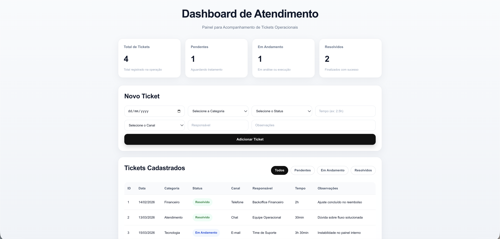

# 📊 OPS Dashboard

Aplicação full stack para cadastro e acompanhamento de tickets operacionais.

## 🧩 O que o projeto faz

O sistema permite:

- cadastrar tickets com informações como data, categoria, status, tempo de resolução, canal, responsável e observações  
- visualizar os tickets em uma tabela  
- filtrar por status  
- acompanhar indicadores simples (total, pendentes, em andamento e resolvidos)  

## 🛠️ Tecnologias

### Frontend
- React
- Vite
- CSS

### Backend
- Node.js
- Express

### Banco de dados
- SQLite

## ✅ Validações

Os dados são validados tanto no frontend quanto no backend.

Algumas regras implementadas:

- todos os campos são obrigatórios  
- a data precisa ser válida  
- o tempo de resolução aceita formatos como:
  - `30min`
  - `1h`
  - `1:30` → convertido para `1h30min`
- responsável: até 60 caracteres  
- observações: até 200 caracteres  

## ▶️ Como rodar o projeto

### 1. Clone o repositório

```bash
git clone <seu-repo>
cd ops-dashboard
```

---

### 🔧 Backend

```bash
cd backend
npm install
npm run dev
```

O backend roda em:

```
http://localhost:3000
```

---

### 💻 Frontend

Em outro terminal:

```bash
cd frontend
cp .env.example .env
npm install
npm run dev
```

No `.env`, use:

```
VITE_API_URL=http://localhost:3000
```

O frontend roda em:

```
http://localhost:5173
```

---

## 🗂️ Estrutura do projeto

```
ops-dashboard/
├── backend/
├── frontend/
├── dashboard.png
└── README.md
```

---

## 📸 Preview



---

## ⚠️ Observação

Em ambiente de desenvolvimento, os tickets são apagados ao reiniciar o servidor.  
Isso foi mantido para facilitar testes durante o desenvolvimento.

---

## 👩‍💻 Autora

Vitória Candido

Estudante de Sistemas de Informação 

---

## 💡 Sobre o projeto

Este projeto foi desenvolvido como prática de uma aplicação full stack, cobrindo desde a criação de APIs até a interface com o usuário.

A ideia foi focar em algo simples, mas funcional, com validações e organização de código.